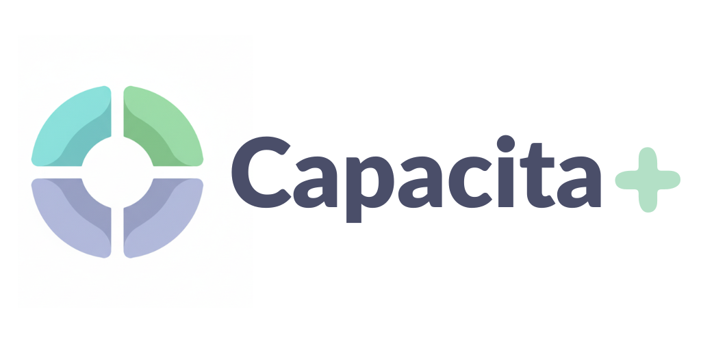

<h1 align="center"> Capacita + <br>
</h1>

### O Capacita+ é uma plataforma educacional inclusiva, projetada especificamente para apoiar alunos neurodivergentes (TEA, TDA, TDAH, entre outros). Nosso objetivo é romper barreiras no aprendizado através de um ensino personalizado, fornecendo as ferramentas necessárias para que cada estudante desenvolva seu potencial máximo e construa um futuro com mais autonomia e oportunidades

<h2 align="center"> ⛏️💻 Stacks e Tecnologias Utilizadas: </h2>
<p align="center">
<br>


<br>


</p>

<h2 align="center"> 🏛️ Arquitetura Geral do Projeto: </h2>

<pre>
|README.md
|Capacita-Mais/
├── BackEnd/
├── FrontEnd/
├── docker-compose.yml
└── README.md
</pre>


<h2 align="left"> Frontending </h2>
<pre>
|README.md
|Capacita-Front/
├── node_modules/
├── public/ 
├── src/
│   ├── assets/ 
│   ├── components/ 
│   ├── hooks/ 
│   ├── pages/ 
│   ├── App.css 
│   ├── App.jsx 
│   ├── index.css 
│   └── main.jsx 
├── .gitignore 
├── eslint.config.js 
└── index.html 
</pre>

<h2 align="left">  Backending</h2>

<pre>
|README.md
|capacita-back-end/
├── dist/ 
├── node_modules/ 
├── prisma/ 
├── src/ 
├── test/ 
├── .env 
├── .gitignore 
├── .prettierrc 
├── docker-compose.yml 
├── eslint.config.mjs 
├── nest-cli.json 
├── openapi.yaml 
├── package-lock.json 
├── package.json 
├── prisma.config.mjs 
├── README.md 
├── tsconfig.build.json 
└── tsconfig.json 
</pre>


<h2 align="center"> 👤👩‍🏫 Docente Responsável: </h2>
<ul>
  <li><strong>Aêda Monalliza Cunha de Sousa</strong> <a href="https://www.linkedin.com/in/aedasousa/" target="_blank"></a></li>
</ul>

<h2 align="center"> 👥 Integrantes do Projeto: </h2>
<ul>
  <li><strong>Victor José Paes (Líder 👑)</strong> <a href="https://www.linkedin.com/in/viictorpaes/" target="_blank"></a> <a href="https://github.com/viictorpaes" target="_blank"></a></li>
  <li>Cauã Henrique de Melo Almeida <a href="https://www.linkedin.com/in/caua-henrique-melo-almeida-b83744380/" target="_blank"></a></li>
  <li>Eduardo de Souza Cavalcanti Junior <a href="https://www.linkedin.com/in/eduardoscavalcantij/" target="_blank"></a> <a href="https://github.com/eduardo-scavalcanti" target="_blank"></a></li>
  <li>Felipe Franca Alves de Lima <a href="https://www.linkedin.com/in/felipefrancaal/" target="_blank"></a> <a href="https://github.com/ffrancaal" target="_blank"></a></li>
  <li>Helamã Leone de Lima Procídio <a href="https://www.linkedin.com/in/helam%C3%A3-procidio-428772367/" target="_blank"></a> <a href="https://github.com/procidiohelama-star" target="_blank"></a></li>
  <li>João Pedro Arruda Guimarães <a href="https://www.linkedin.com/in/jo%C3%A3o-pedro-arruda-guimar%C3%A3es-157952287/" target="_blank"></a> <a href="https://github.com/Jp230603" target="_blank"></a></li>
  <li>Lucas Moreira de Carvalho</li>
  <li>Lucas Paguetti Pereira <a href="https://www.linkedin.com/in/lucas-paguetti-pereira" target="_blank"></a> <a href="https://github.com/wqiluc" target="_blank"></a></li>
  <li>Maria Eduarda Vasconcelos da Silva <a href="https://www.linkedin.com/in/maria-eduarda-vasconcelos-5877401b7/" target="_blank"></a> <a href="https://github.com/mariavsvasconcelos-maker" target="_blank"></a></li>
  <li>Mateus Henrique Diniz da Silva</li>
  <li>Pablo Tamborini Nogueira <a href="https://www.linkedin.com/in/pablo-tamborini-nogueira/" target="_blank"></a></li>
  <li>Tiago Luiz Moreira de Vasconcelos <a href="https://www.linkedin.com/in/tiagoluiz23/" target="_blank"></a> <a href="https://github.com/2006tiagoluiz" target="_blank"></a></li>
  <li>Victor Barros Roma <a href="https://www.linkedin.com/in/victor-roma-38035a111/" target="_blank"></a> <a href="https://github.com/RomaNFS21" target="_blank"></a></li>
</ul>

<h2 align="center"> 🕹️ Comandos para inicializar o projeto: <br>
</h2>

### Siga os passos abaixo para configurar o ambiente e executar a aplicação localmente em sua máquina:

###
<ul>
  <li>
  Windows  <br>
    <code>Ctrl</code> + <code>j</code> (tecla de crase)
  </li> <br>
  <li>
     <br>
    <code>Ctrl</code> + <code>j</code> (tecla de crase)
  </li> <br>
  <li>
     <br>
    <code>Command</code> + <code>j</code> (tecla de crase)
  </li>
</ul>

<br>

- Após baixar o Github desktop: <br>


```bash
# Clone o repositório:
git clone (https://github.com/viictorpaes/Capacita-Mais)

#Acesse ele com o VSCODE, ou a sua IDE

# Acesse a arquitetura principal do projeto:
ls

# Instale as dependências
npm install

#Acessando a pasta do backending: 
cd BackEnd 
ls
cd capacita-back-end
ls

#inicializando o docker e o prisma: 
docker compose up
npx prima migrate
npx push db
npx prisma studio (acessa o banco na web) 

#Acessando a pasta do frontending: 
ls
cd FrontEnd   
ls
cd Capacita-Front
npm run dev
acesse: http://localhost:5173/
```

<h2 align="center"> 🔑 Versões mínimas para rodar o projeto: </h2>

<div style="display: flex; flex-wrap: wrap; justify-content: center; align-items: center; gap: 10px; width: 100%;">
  
  
  
  
  
  
  
  
  
  
  
  
  
  
  
</div>

<h2 align="center"> 🛠️ Como preparar o ambiente e instalar: </h2>

<p align="center">
  Para garantir que o projeto <strong>rode sem erros</strong>, siga os passos abaixo no seu terminal:
</p>

### 1. Instalação Global (Requisitos do Sistema)
<ul>
  <li><strong>Node.js:</strong> Baixe a versão <strong>LTS</strong> (v22+) no site oficial <a href="https://nodejs.org/">nodejs.org</a>.</li>
  <li><strong>Gerenciador de Pacotes:</strong> O NPM já vem com o Node, mas garanta que está atualizado: <br>
  <code>npm install -g npm@latest</code></li>
</ul>

### 2. Configurando o Projeto
Execute os comandos dentro das respectivas pastas (front e back):

<ul>
  <li><strong>Dependências:</strong> <code>npm install</code></li>
  <li><strong>Banco de Dados (Back-end):</strong> <code>npx prisma generate</code></li>
  <li><strong>Rodar em Desenvolvimento:</strong> <code>npm run dev</code> (Front) ou <code>npm run start:dev</code> (Back)</li>
</ul>
